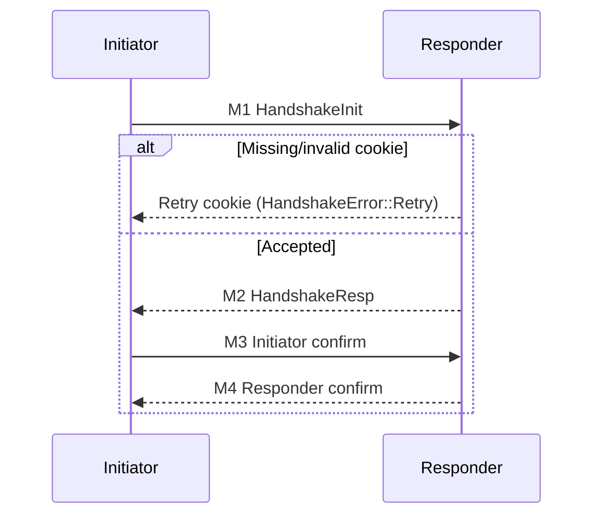

# Wire Format Specification (v1)

This document describes the wire-visible structures and state machines implemented by the Chhaya Rust crate. It covers the authenticated key exchange (messages M1–M4), retry cookies, the sealed-sender envelope, and the Double Ratchet transport. For a higher-level discussion see [How It Works](./how-it-works.md); for adversary analysis consult the [Threat Model](./threat-model.md).

## Constants

| Constant | Value | Description |
| --- | --- | --- |
| `WIRE_VER` | `0x01` | Domain separation octet injected into all HKDF invocations. Defined with the other protocol constants in [`src/lib.rs`](../src/lib.rs#L77-L85) and mixed into HKDF salts by [`hkdf32`](../src/lib.rs#L848-L857). |
| `PROTO_VER` | `"v1"` | Protocol version string included in transcripts, AAD, and HKDF salts. Declared in the same constants block and consumed by [`proto_aad`](../src/lib.rs#L1044-L1054) and HKDF helpers such as [`hkdf32`](../src/lib.rs#L848-L857). |
| `PROTO_SUITE` | `"X25519+ML-KEM-1024:AES-256-GCM"` | Identifies the hybrid KEM + AEAD suite for bind values, AEAD AAD, and HKDF salts. See the protocol constant definitions in [`src/lib.rs`](../src/lib.rs#L77-L85) and the HKDF helper [`hkdf64`](../src/lib.rs#L860-L868). |
| `ROLE_I` | `0x49` (`'I'`) | Role tag for initiator-bound transcripts, nonces, and AAD. Defined with the constants in [`src/lib.rs`](../src/lib.rs#L77-L85) and threaded through [`proto_aad`](../src/lib.rs#L1044-L1054) and [`initiator_key_confirm`](../src/lib.rs#L1665-L1678). |
| `ROLE_R` | `0x52` (`'R'`) | Role tag for responder-bound transcripts, nonces, and AAD. Defined alongside `ROLE_I` in [`src/lib.rs`](../src/lib.rs#L77-L85) and used by [`proto_aad`](../src/lib.rs#L1044-L1054) as well as [`responder_key_confirm`](../src/lib.rs#L1700-L1711). |
| `COOKIE_FMT_V1` | `0x01` | Retry cookie key identifier mixed into HMAC derivation. Declared next to [`RetryCookie`](../src/lib.rs#L248-L266) and consumed by [`make_retry_cookie`](../src/lib.rs#L437-L463). |
| `DR_MAX_COUNTER` | `2^{20}` | Absolute ceiling for Double Ratchet message and previous counters. Declared with the Double Ratchet transport types in [`src/lib.rs`](../src/lib.rs#L1904-L2053) and enforced by [`DrPeer::receive_message`](../src/lib.rs#L2042-L2053). |
| `ENVELOPE_V1` | `0x01` | Version byte prepended to sealed-sender envelopes. Defined with [`SealedEnvelope`](../src/lib.rs#L1913-L1945) and checked during decoding in [`decode_envelope`](../src/lib.rs#L1929-L1945). |

## Versioning & HKDF domains

Every KDF invocation salts HKDF-SHA256 with `WIRE_VER || PROTO_VER || PROTO_SUITE || context` (context-specific label bytes follow immediately). The helper routines [`hkdf32`](../src/lib.rs#L848-L857) and [`hkdf64`](../src/lib.rs#L860-L868) apply that domain separation for handshake material and ratchet roots, forcing implementations to agree on the same protocol release and cipher suite. Any node speaking a different `WIRE_VER` or suite will derive divergent keys and fail to authenticate.

## Retry cookie binary format

Retry cookies are fixed-length structures that embed a MAC, timestamp, proof-of-work puzzle, and solver nonce. They are produced by [`append_cookie_bytes`](../src/lib.rs#L946-L952) and parsed by [`decode_retry_cookie`](../src/lib.rs#L954-L975). Multi-octet integers use little-endian encoding.

```text
Offset  Size  Field
0x00    32    mac[32]    HMAC-SHA256 over key id, context, timestamp, puzzle
0x20     8    ts         Unix timestamp seconds, little-endian u64
0x28    16    challenge  Puzzle challenge bytes
0x38     1    difficulty Leading-zero target (0–255)
0x39     8    nonce      Solver nonce, little-endian u64
```

Example (hex, wrapped):

```
mac      = ffd1…20 (32 bytes)
ts       = 00000000000003e8 (1000 decimal)
challenge= 4c71…aa (16 bytes)
difficulty = 10
nonce    = 2a00000000000000
wire     = ffd1…2040 00000000000003e8 4c71…aa 10 2a00000000000000
```

## Handshake overview

### Actors & stored state

* **Initiator** tracks `InitiatorState`: ephemeral X25519 secret, hybrid shared secret, and transcript bind. Secrets are zeroized on drop; see [`InitiatorState`](../src/lib.rs#L1213-L1224).
* **Responder** tracks `ResponderState`: static X25519 prekey secret, ML-KEM secret key, hybrid secret, and transcript bind. Secrets are zeroized on drop in [`ResponderState`](../src/lib.rs#L1228-L1241).
* Successful confirmation yields `SessionKeys` (32-byte AES-256-GCM keys each direction plus a handshake hash) wrapped in an `AuthedSession`. The structs live in [`src/lib.rs`](../src/lib.rs#L773-L784).

### Message flow



### State machine transitions and verification

**Responder processing M1 → either Retry, failure, or provisional session S₀**
1. Recreate cookie context over M1 fields (ephemeral key, ML-KEM ciphertext, DID, epoch, batch root, spend receipt, padding) and verify the provided cookie against all active server-share sets; on success record a puzzle success, otherwise mint a fresh cookie with updated difficulty and abort. ([source](../src/lib.rs#L1383-L1414))
2. Ensure the directory record matches DID/epoch/prekey batch and that the spend receipt batch root aligns. ([source](../src/lib.rs#L1429-L1437))
3. Validate the embedded VKD proof bundle (leaf hash match, witness quorum, VRF). ([source](../src/lib.rs#L1439-L1462))
4. Recompute the transcript bind using `compute_transcript_bind_v2` (which mixes protocol version, suite, both public keys, ML-KEM ciphertext, DID, epoch, spend receipt contents, quorum digest, VKD material, padding, and optional cookie bytes) and require equality with the transmitted 32-byte bind. ([bind derivation](../src/lib.rs#L1464-L1483), [`compute_transcript_bind_v2`](../src/lib.rs#L954-L1034))
5. Derive a session identifier from the bind and reject if replay cache indicates prior use. ([source](../src/lib.rs#L1540-L1545), [`session_id_from_bind`](../src/lib.rs#L941-L943))
6. Verify the spend receipt against the provided verifier hook. ([source](../src/lib.rs#L1547-L1557))
7. Compute the hybrid shared secret: X25519(Eᵢ, R_prekey) followed by ML-KEM decapsulation of the ciphertext under the responder’s ML-KEM secret key. Reject if either Diffie-Hellman output is all zeros or decapsulation fails. ([source](../src/lib.rs#L1560-L1575))
8. Derive provisional session S₀ from the hybrid secret and bind; generate responder ephemeral key pair (`er_sk`, `er_pub`) and server random `sr`, and encrypt the RESP-OK payload under S₀’s responder AEAD key with deterministic nonce `[ROLE_R, 0x02]` HKDF’d from the S₀ handshake hash. ([source](../src/lib.rs#L1578-L1608), [`hkdf_n12`](../src/lib.rs#L872-L879), [`proto_aad`](../src/lib.rs#L1044-L1054), [`encode_resp_ok`](../src/lib.rs#L1078-L1101))
9. Derive final session S_f using HKDF over the S₀ handshake hash, the fresh X25519 shared secret with `er_sk`, and the server random; zeroize intermediate secrets before returning. ([source](../src/lib.rs#L1610-L1617), [`derive_final_session`](../src/lib.rs#L858-L870))


**Initiator processing M2 → S₀ to S_f**
1. Recompute S₀ from the cached hybrid secret and transcript bind. ([source](../src/lib.rs#L1630-L1638), [`derive_session`](../src/lib.rs#L889-L917))
2. Decrypt M2 using the responder-direction AEAD key, deterministic nonce `[ROLE_R,0x02]`, and AAD `proto_aad(ROLE_R, bind)`. Reject if decryption fails. ([source](../src/lib.rs#L1639-L1647), [`proto_aad`](../src/lib.rs#L1044-L1054))
3. Parse the RESP-OK payload (`"RESP-OK" || bind || er_pub || sr || pad_len || pad`) and validate bind equality. ([source](../src/lib.rs#L1648-L1652), [`decode_resp_ok`](../src/lib.rs#L1104-L1119))
4. Compute X25519(Eᵢ_sk, `er_pub`), ensure it is non-zero, and derive S_f using the S₀ handshake hash plus the DH output and server random. ([source](../src/lib.rs#L1654-L1661), [`derive_final_session`](../src/lib.rs#L858-L870))


**Initiator confirm (M3) → Responder verify**
1. Initiator derives deterministic nonce `HKDF_n12(handshake_hash, [ROLE_I,0x03])`, prepares message `INIT-OK || handshake_hash || pad_len || pad` via `encode_label_hash`, and encrypts under the initiator-direction AEAD key with AAD `proto_aad(ROLE_I, handshake_hash)`. ([source](../src/lib.rs#L1665-L1678), [`hkdf_n12`](../src/lib.rs#L872-L879), [`proto_aad`](../src/lib.rs#L1044-L1054), [`encode_label_hash`](../src/lib.rs#L1122-L1139), [`aead_encrypt`](../src/lib.rs#L916-L924))
2. Responder decrypts using the same nonce and AAD, parses the label payload, and checks the embedded handshake hash for equality. Failure aborts the handshake. ([source](../src/lib.rs#L1680-L1697), [`aead_decrypt`](../src/lib.rs#L926-L937), [`proto_aad`](../src/lib.rs#L1044-L1054), [`decode_label_hash`](../src/lib.rs#L1142-L1153))


**Responder confirm (M4) → Initiator verify**
1. Responder derives deterministic nonce `HKDF_n12(handshake_hash, [ROLE_R,0x04])`, encodes `RESP-FIN || handshake_hash || pad_len || pad`, and encrypts under the responder-direction key with role-specific AAD. ([source](../src/lib.rs#L1700-L1711), [`hkdf_n12`](../src/lib.rs#L872-L879), [`proto_aad`](../src/lib.rs#L1044-L1054), [`encode_label_hash`](../src/lib.rs#L1122-L1139), [`aead_encrypt`](../src/lib.rs#L916-L924))
2. Initiator decrypts, parses the label payload, and checks the handshake hash. Acceptance transitions both peers into the `AuthedSession` state and unlocks the Double Ratchet. ([source](../src/lib.rs#L1713-L1730), [`aead_decrypt`](../src/lib.rs#L926-L937), [`proto_aad`](../src/lib.rs#L1044-L1054), [`decode_label_hash`](../src/lib.rs#L1142-L1153))


## Message formats

All fields below are listed in transmission order. Unless noted, multi-octet integers are serialized little-endian, matching the helper routines used to build transcript binds, cookies, and envelopes.

### M1: `HandshakeInit`

| Field | Size | Notes |
| --- | --- | --- |
| `eph_x25519_pub` | 32 bytes | Initiator ephemeral X25519 public key. Emitted by [`initiator_handshake_init`](../src/lib.rs#L1250-L1317) and stored in [`HandshakeInit`](../src/lib.rs#L726-L736). |
| `kem_ciphertext` | `ml_kem_1024::CT_LEN` bytes | ML-KEM-1024 ciphertext targeting the responder prekey, produced by [`initiator_handshake_init`](../src/lib.rs#L1250-L1317) via [`MlKem1024::encapsulate`](../src/lib.rs#L220-L231). |
| `did` | variable | UTF-8 DID bytes from the directory record. See [`DirectoryRecord`](../src/lib.rs#L499-L538) and [`HandshakeInit`](../src/lib.rs#L726-L736). |
| `epoch` | 8 bytes | Directory epoch, little-endian. Populated from [`DirectoryRecord`](../src/lib.rs#L499-L538). |
| `prekey_batch_root` | 32 bytes | Directory Merkle root for one-time prekeys sourced from [`DirectoryRecord`](../src/lib.rs#L499-L538). |
| `spend` | 32+32+len(sig)+8 bytes | Spend receipt: batch root, nullifier, quorum signature, and little-endian epoch. See [`SpendReceipt`](../src/lib.rs#L522-L526) and [`initiator_handshake_init`](../src/lib.rs#L1250-L1317). |
| `sth_cid` | variable | CID of the Signed Tree Head attested by the VKD proof. Derived in [`initiator_handshake_init`](../src/lib.rs#L1250-L1317) and validated by [`responder_handshake_resp`](../src/lib.rs#L1328-L1525). |
| `bundle_cid` | variable | CID of the directory record bundle validated against the VKD leaf. Generated in [`initiator_handshake_init`](../src/lib.rs#L1250-L1317) and checked by [`responder_handshake_resp`](../src/lib.rs#L1328-L1525). |
| `vkd_proof` | variable | VKD audit proof bundle copied verbatim. Structured as [`VkdProof`](../src/lib.rs#L530-L548) and validated by [`verify_vkd_proof`](../src/lib.rs#L559-L604). |
| `pad` | variable | Cover traffic padding bucketed to {0,32,64,128,256} bytes. Chosen using [`bucket_pad_len`](../src/lib.rs#L1068-L1075) inside [`initiator_handshake_init`](../src/lib.rs#L1299-L1344). |
| `transcript_bind` | 32 bytes | SHA-256 of the transcript binding context (see below). Computed by [`compute_transcript_bind_v2`](../src/lib.rs#L978-L1041). |
| `cookie` | optional | Retry cookie bytes (fixed 65 octets when present). Propagates [`RetryCookie`](../src/lib.rs#L248-L266) from the directory response through [`initiator_handshake_init`](../src/lib.rs#L1333-L1346). |

The transcript bind accumulates the protocol version, suite, both role tags, the two X25519 keys, ML-KEM ciphertext, DID, epoch, prekey root, spend receipt contents, the STH and bundle CIDs, the quorum digest & VKD proof (with 16-bit little-endian length prefixes for variable components), padding, and optional cookie bytes before hashing with SHA-256. See [`compute_transcript_bind_v2`](../src/lib.rs#L954-L1034). This value is transmitted verbatim and revalidated by the responder.

**Byte diagram (logical order prior to outer serialization):**

```text
PROTO_VER || PROTO_SUITE || ROLE_I || Ie || ROLE_R || Rpre || KEM_CT || DID || epoch_LE || batch_root ||
receipt.batch_root || receipt.nullifier || receipt.quorum_sig || receipt.quorum_epoch_LE || quorum_digest? ||
VKD? || pad || cookie?
```

### M2: `HandshakeResp`

Outer structure:

| Field | Size | Notes |
| --- | --- | --- |
| `nonce` | 12 bytes | Deterministic AEAD nonce `HKDF_n12(S₀.handshake_hash, [ROLE_R,0x02])` generated in [`responder_handshake_resp`](../src/lib.rs#L1578-L1608) using [`hkdf_n12`](../src/lib.rs#L872-L879). |
| `confirm_tag` | variable | AES-256-GCM ciphertext + tag over the RESP-OK payload produced by [`responder_handshake_resp`](../src/lib.rs#L1578-L1608) with [`aead_encrypt`](../src/lib.rs#L916-L924). |

RESP-OK plaintext (before padding):

| Component | Size | Notes |
| --- | --- | --- |
| ASCII literal `"RESP-OK"` | 7 bytes | Constant header emitted by [`encode_resp_ok`](../src/lib.rs#L1078-L1101). |
| `bind` | 32 bytes | Echo of transcript bind. Packed and verified by [`encode_resp_ok`](../src/lib.rs#L1078-L1101) and [`decode_resp_ok`](../src/lib.rs#L1104-L1119). |
| `er_pub` | 32 bytes | Responder ephemeral X25519 public key. Inserted by [`responder_handshake_resp`](../src/lib.rs#L1578-L1608) and checked by [`initiator_handshake_finalize`](../src/lib.rs#L1639-L1661). |
| `sr` | 32 bytes | Fresh server random for replay mixing. Generated in [`responder_handshake_resp`](../src/lib.rs#L1583-L1608) and consumed by [`initiator_handshake_finalize`](../src/lib.rs#L1648-L1661). |
| `pad_len` | 2 bytes | Little-endian length of cover padding chosen in [`encode_resp_ok`](../src/lib.rs#L1078-L1101). |
| `pad` | variable | Zero or bucket-sized random padding filled by [`encode_resp_ok`](../src/lib.rs#L1078-L1101). |

**Byte diagram:**

```text
0         7      39      71      103    105
+---------+------+-------+--------+------+----...
|"RESP-OK"| bind | er_pk |  sr    | len  | pad
+---------+------+-------+--------+------+----...
```

### M3: Initiator confirmation (`HandshakeConfirm`)

| Field | Size | Notes |
| --- | --- | --- |
| `nonce` | 12 bytes | `HKDF_n12(handshake_hash, [ROLE_I,0x03])` derived in [`initiator_key_confirm`](../src/lib.rs#L1665-L1678) using [`hkdf_n12`](../src/lib.rs#L872-L879). |
| `tag` | variable | AES-256-GCM ciphertext of the label payload using the initiator-direction key, produced by [`initiator_key_confirm`](../src/lib.rs#L1665-L1678) via [`aead_encrypt`](../src/lib.rs#L916-L924). |

Payload format from [`encode_label_hash`](../src/lib.rs#L1122-L1139):

```text
label ("INIT-OK") || handshake_hash || pad_len_LE (2 bytes) || pad
```

The responder decrypts, verifies the label, and compares the embedded handshake hash using [`responder_verify_initiator`](../src/lib.rs#L1680-L1697).

### M4: Responder confirmation (`HandshakeConfirm`)

Identical structure to M3, but nonce info `[ROLE_R,0x04]`, label `"RESP-FIN"`, and encryption under the responder-direction key handled by [`responder_key_confirm`](../src/lib.rs#L1700-L1711) and verified via [`initiator_verify_responder`](../src/lib.rs#L1713-L1730).

## AEAD additional data

Handshake AEADs use `proto_aad(role, bind_or_hash)`. The layout is:

```text
0        1        1+|VER|  1+|VER|+1   …
+--------+-----------+---------+-------------------
|len(ver)| PROTO_VER |len(suite)| PROTO_SUITE |0x01| role |len(bind)| bind
+--------+-----------+---------+-------------------
```

Lengths are single bytes (allowing up to 255 octets for version, suite, or bind/hash). See [`proto_aad`](../src/lib.rs#L1044-L1054). The bind/hash input is always 32 bytes in this implementation.

Double Ratchet messages reuse a constant domain-separated AAD: `"DR" || len(PROTO_VER) || PROTO_VER || len(PROTO_SUITE) || PROTO_SUITE`, provided by [`dr_aad`](../src/lib.rs#L1057-L1065).

## Deterministic nonce derivation

All AES-256-GCM operations use HKDF-derived deterministic nonces:

* Handshake nonces call `hkdf_n12(handshake_hash, [role, message_id])`, where `message_id` is 0x02 for M2, 0x03 for M3, and 0x04 for M4. The helper [`hkdf_n12`](../src/lib.rs#L872-L879) is invoked from [`responder_handshake_resp`](../src/lib.rs#L1578-L1608), [`initiator_key_confirm`](../src/lib.rs#L1665-L1678), and [`responder_key_confirm`](../src/lib.rs#L1700-L1711).
* Double Ratchet message keys derive nonces as `HKDF_n12(message_key, "dr-msg-nonce")` inside the crypto provider used by [`DrPeer`](../src/lib.rs#L1980-L2369); see [`dr_crypto::CryptoProvider`](../src/lib.rs#L1805-L1872).

Because the underlying handshake hash and per-direction message keys are unique per session, these deterministic nonces are single-use.

## Double Ratchet transport

### Application message container

[`AppMessage`](../src/lib.rs#L1997-L2369) carries Double Ratchet ciphertexts on the wire.

| Field | Size | Notes |
| --- | --- | --- |
| `header.dh` | 32 bytes | Diffie-Hellman public key for this ratchet step, serialized by [`HeaderWire`](../src/lib.rs#L1987-L1991). |
| `header.n` | 4 bytes | Message number (little-endian); must not exceed `DR_MAX_COUNTER`. Enforced in [`DrPeer::receive_message`](../src/lib.rs#L2359-L2369). |
| `header.pn` | 4 bytes | Previous chain length (little-endian); bounded by `DR_MAX_COUNTER`. Checked alongside `header.n` in [`DrPeer::receive_message`](../src/lib.rs#L2359-L2369). |
| `ciphertext` | variable | AES-256-GCM output from the Double Ratchet library using deterministic per-message nonces. Produced and consumed by [`DrPeer::send_message`](../src/lib.rs#L2357-L2375) and [`DrPeer::receive_message`](../src/lib.rs#L2377-L2391). |

### Sealed-sender envelope v1

Before encryption, application data is wrapped in a [`SealedEnvelope`](../src/lib.rs#L2004-L2052) to hide sender metadata.

```text
0      1      5            5+S         9+S         9+S+P      11+S+P     11+S+P+pad
+------+-------+------------+-----------+-----------+---------+-----------+-------------+
|0x01 | S_le  | sender[S]  | P_le      | payload[P]| pad_le | pad[pad]  |
+------+-------+------------+-----------+-----------+---------+-----------+-------------+
```

* `S_le` and `P_le` are 32-bit little-endian lengths; `pad_le` is a 16-bit little-endian padding length.
* `CoverPadding` selects a target bucket so that `S + P + 11 + pad_le` equals that bucket and remains ≤ 65,536 bytes (`ENVELOPE_MAX`). Enforced by [`encode_envelope`](../src/lib.rs#L2013-L2042) and checked in [`DrPeer::send_message`](../src/lib.rs#L2357-L2375).
* For backward compatibility the decoder accepts envelopes without the optional padding suffix, treating them as `pad_le = 0`.

Example: Sender=`"alice"` (5 bytes), Payload=`"hi"` (2 bytes) ⇒

```
01 05000000 616c696365 02000000 6869 0000
```

### Sending & receiving

[`DrPeer::send_message`](../src/lib.rs#L2343-L2355) validates envelope size, encrypts using the negotiated Double Ratchet state with caller-supplied AAD (typically `dr_aad()`), and returns `AppMessage`. [`DrPeer::receive_message`](../src/lib.rs#L2359-L2369) enforces counter limits, decrypts, and decodes the envelope.

## Examples

### Example AADs

* Handshake AAD for initiator role with handshake hash `H`:
  ```
  proto_aad = len("v1") || "v1" || len("X25519+…") || "X25519+…" || 0x01 || 0x49 || 0x20 || H
  ```
  (see [`proto_aad`](../src/lib.rs#L1044-L1054))
* Double Ratchet AAD:
  ```
  dr_aad = "DR" || len("v1") || "v1" || len("X25519+…") || "X25519+…"
  ```
  (implemented by [`dr_aad`](../src/lib.rs#L1057-L1065))

### Sample deterministic nonce inputs

* M2 nonce input: `hkdf_n12(S₀.handshake_hash, [0x52, 0x02])`. Derived in [`responder_handshake_resp`](../src/lib.rs#L1578-L1608).
* M3 nonce input: `hkdf_n12(handshake_hash, [0x49, 0x03])`. Derived in [`initiator_key_confirm`](../src/lib.rs#L1665-L1678).
* DR message nonce input: `hkdf_n12(message_key, b"dr-msg-nonce")`. Applied within [`dr_crypto::CryptoProvider`](../src/lib.rs#L1805-L1872).

### Example RESP-OK parsing

Given ciphertext plaintext bytes:

```
52 45 53 50 2d 4f 4b | 32-byte bind | 32-byte er_pub | 32-byte sr |
0400 | abcd… (4 bytes pad)
```

The parser extracts bind/keys/random, reads pad length `0x0004`, and treats the final four bytes as opaque cover padding using [`decode_resp_ok`](../src/lib.rs#L1104-L1119).

## Summary

Implementations must honor the deterministic KDF domains, reproduce the transcript bind exactly, and follow the validation steps per transition to interoperate with the existing Rust crate. Any deviation in ordering, lengths, or endianness will cause authentication failures or replay rejection.
